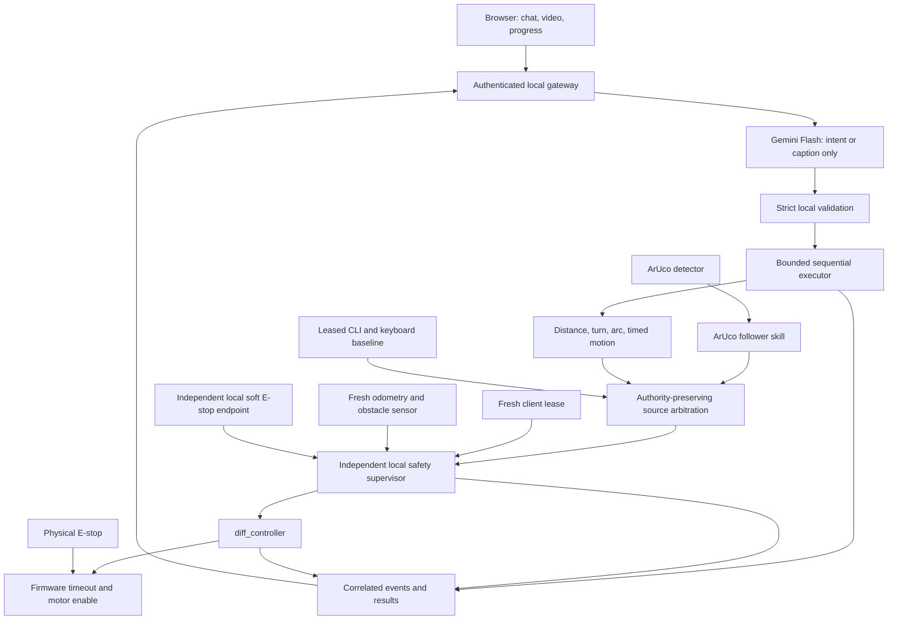
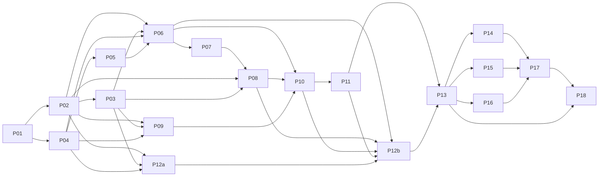

# Thesis robot consolidation blueprint

Version 0.2, 2026-09-25. Status: **reviewed draft; awaiting junior inventory and remaining interview answers**. No migration, robot deployment, firmware flashing, experiment, repository deletion, or publication approval is authorized by this document's creation.

## Objective and reading order

Make `aruco_marker_tracking_and_following_ros2` the sole deployable source for the existing robot, retaining its ArUco pipeline and adding bounded language control, deterministic execution, observable safety, web interaction, and reproducible research. Finish and accurately report Tests 1–8 before the final retirement gate. An unsuccessful experimental result can be complete evidence; unsafe operation is a reason to stop testing, not to keep collecting trials.

Read this file, [source audit](consolidation-source-audit.md), [execution contracts](consolidation-contracts.md), [PR work packages](consolidation-steps.md), [deployment runbook specification](consolidation-deployment.md), and [research protocols](consolidation-research.md). All are one blueprint package. Paths in those files are relative to the target repository unless prefixed `sia-bot/` or `required-tests/`, which refer to sibling input directories. Newly proposed files, scripts, packages, services, and commands **do not exist yet**. Their owning PR must implement and validate them before subsequent steps may use them.

## Decisions and interview ledger

| ID | Decision / evidence needed | Current state | Recommended branch and consequence | Alternative and consequence |
|---|---|---|---|---|
| D1 | Actual computer/RAM, OS, ROS, camera, sensors, controller/firmware, topics | User away from robot; junior will collect report, owner will return facts | Preserve the observed working robot release; collect exact inventory in P01 using the junior handoff. README Jazzy is a hypothesis, not a hardware fact. | Unknown means no hardware-specific deployment or motion sign-off. OS migration, if desired, is a separate validated project. |
| D2 | Physical E-stop, motor watchdog, obstacle sensor, test area, actual disconnect behavior | Deferred to junior inventory; effectiveness still requires later qualification | Independent motor disable and firmware command expiry, supervised area, local lease expiry stopping motion. P05/P06/P13 establish measured limits. | Missing hardware or sensing blocks floor tests; simulation/wheels-raised only. Software zeros cannot substitute for independent motor disable. |
| D3 | Preserve every thesis claim? | **User confirmed: preserve goals; correct or narrow claims** | Retain web-first bounded control and Tests 1–8; replace unsupported numbers and document architecture changes. | Preserving every feature would need extra implementation and studies; not selected. |
| D4 | Gemini provider/model, API access, budget, image descriptions, offline behavior | User requested researched latest efficient Flash recommendation; see model note. Access/budget and remaining preferences pending | Recommend direct Google `gemini-3.8-flash`, low thinking, descriptions enabled, no new cloud-language motion offline; local stop/status always available. Validate account access and pilot latency/accuracy. No paid calls until cap/access are set. | `gemini-3.5-flash-lite` is the cost comparator; use only if a separate pilot supports it. OpenRouter adds gateway verification. Offline motion needs separately validated parser. Omitting descriptions requires study amendment. |
| D5 | Study operator/recruiter, safety observer, institutional requirements, consent/data retention | **User confirmed: undecided** | Assign owner to obtain supervisor/institution determination, recruit operator/observer and plan participants in P12a; do not assume approval or participants exist. | Unavailable recruitment/approval leaves Tests 2–3 pending; software or synthetic participants cannot complete them. |
| D6 | Comparison condition | **User confirmed: web versus CLI-plus-teleop toolchain** | Two-condition counterbalanced within-participant study, equal safety gates and task capabilities. Report a toolchain comparison, not separate causal effects of CLI and teleop. | Three separate conditions increases burden; not selected. |
| D7 | Retire sia-bot | **User confirmed: cease deployment; retain read-only archive** | P18 removes deployment dependency after all gates; preserve provenance and restore instructions. | No local deletion or hosted-repository archival selected. |
| D8 | Exact task grounding and acceptance tolerances | Proposed; resolve in P01/P12 | Document a surveyed window bearing for the study, explicit circle radius/direction, and clarification policy. Pilot and freeze tolerances before research data. | Semantic recognition of arbitrary windows requires a new perception/localization capability and validation. Never pretend the current marker follower provides it. |

Unanswered questions are not consent to a recommendation. This draft supports read-only P01 inventory now; dependent implementation decisions require explicit answers or a recorded, verifiable inventory. Finalize the hardware deployment branch after D1/D2 inventory and D4 access/budget decisions; D5 is explicitly undecided and remains a P12a/P16 execution blocker until resolved. D8 can be resolved with the study supervisor during protocol preparation. See [researched Gemini recommendation](consolidation-model-choice.md).

## Architecture decision

The user-supplied summary of the previous council recommendation is the starting hypothesis; the original council transcript was not supplied. Static inspection supports retaining the ArUco detector, visual controller, serial hardware interface, robot description, and simulation as the hardware-specific foundation. It does **not** establish that this snapshot equals the running robot, or that the commander supports thesis-wide behavior.

Adopt Gemini only as an untrusted text-to-intent translator, with a separate read-only image-caption operation. No LLM tool may publish velocities, change policy, invoke a shell, call arbitrary ROS services, or reset a safety latch. Deterministic local software owns execution and all stops. Port useful contracts and UI behaviors from sia-bot only after adapting and testing them; do not carry over ROSA/LangChain as an actuator or copy its environment lockfile.

One final velocity publisher is permitted: the supervisor. All existing follower, joystick, CLI, and simulator paths must route through it with authority-bearing candidates. The arbitration box is the supervisor's deterministic selector; existing twist_mux is not assumed to preserve custom goal/lease identity and loses its direct actuator route. E-stop affects every source. An ordinary ROS topic name is not an access-control boundary: protect controller topics from untrusted DDS/rosbridge clients, restrict network exposure, and test publisher ownership. Physical E-stop and controller firmware timeout remain necessary if Linux, DDS, or the supervisor fails.

## Dependency graph and effort

Effort estimates are engineering person-days, including focused review/verification, excluding hardware procurement, institutional waiting, recruitment lead time, and corrective iterations after failed physical gates. Research collection needs an operator and observer; person-days are not elapsed days. Strongest reasoning/review is appropriate for contracts, safety, study design, and claims; default implementation support is sufficient for constrained UI/package work.

| PR | Deliverable | Depends on | Estimate |
|---|---|---|---|
| P01 | Baseline, robot inventory, decisions, provenance | Interview and physical access for inventory | 1–2 |
| P02 | Intent, skill, event, safety and topic contracts | P01 | 2–3 |
| P03 | Correlated event recorder and data schemas | P02 | 2–3 |
| P04 | Reproducible environment, clean build, no-motion launch | P01 | 2–4 |
| P05 | Motor disable, firmware watchdog, serial fault handling | P01, P04 | 3–6 plus hardware lead time |
| P06 | Final safety supervisor and arbitration | P02, P03, P04, P05 | 3–5 |
| P07 | Feedback-based bounded motion skills | P06 | 3–5 |
| P08 | Sequential executor, cancellation and idempotency | P02, P03, P07 | 2–4 |
| P09 | Gemini adapter and strict intent validation | P02, P03, P04, D4 | 2–3 |
| P10 | Web gateway, chat, leases, stop, status/health | P06, P08, P09 | 3–5 |
| P11 | Video and snapshot/description pipeline | P10, D4 | 2–4 |
| P12a | Experiment harness, frozen datasets, analysis, study protocol | P02, P03, P04, D5/D6/D8 | 2–3 |
| P12b | Executable safe CLI/teleop comparison | P06, P08, P10, P11, P12a | 1–2 |
| P13 | Integrated qualification and junior clean-checkout rehearsal | P05–P12 | 2–4 |
| P14 | Tests 1/4/5/6 collection and audited results | P12, P13 | 3–5 |
| P15 | Tests 7/8 network and endurance evidence | P12, P13 | 2–3 plus six-hour run |
| P16 | Tests 2/3 human study and paired results | P12, P13, D5 cleared | 3–5 plus recruitment |
| P17 | Publication evidence and claim audit | P14, P15, P16 | 2–4 |
| P18 | Retire sia-bot deployment and preserve archive | P13, P17 | 1–2 |

Total work-package estimate: **41–72 person-days**; allow roughly **46–80 person-days including integration contingency**, plus external waiting. A single developer should budget roughly 10–16 working weeks before external delays; physical faults can substantially increase this. These are estimates, not a delivery promise.

There are **19 PR-sized packages**, with P12 split after review into protocol/analysis preparation (P12a) and baseline implementation (P12b). References to P12 elsewhere denote this pair. Likely engineering critical path: P01 → P04 → P05 → P06 → P07 → P08 → P10 → P11 → P12b → P13 → slowest of P14/P15/P16 → P17 → P18. P02/P03 must finish before P06; late API access makes P09 critical; recruitment/approval can dominate the entire schedule. P02/P03 and P04/P05 can overlap with separate file ownership. P12a can proceed alongside feature development; P12b waits for actual action/lease/vision endpoints. P09 can overlap with P07/P08 after its dependencies. P14/P15/P16 share the robot and cannot be conducted concurrently on it. Analysis of completed immutable sessions may proceed during unrelated collection. No concurrent PRs edit the same launch/config/contracts without explicit integration ownership.

## First executable step

Begin **P01 read-only inventory** using the standalone [junior handoff and fill-in report](junior-robot-inventory.md). The user confirmed on 2026-09-25 that the junior is with the robot and will gather facts; the owner will return them later. Record actual launch commands and working deployment before any upgrade. Keep robot stationary and use only the maintainer's known motor-disable procedure; if unknown, report it rather than improvise. Obtain firmware source/version and wiring evidence from the maintainer. Compare live installation against this local snapshot. No movement, disconnect or stop-effectiveness test is part of inventory. On this Windows workspace, inspect files and compute hashes; do not run Linux motor commands or install a competing stack.

The current copies have no `.git`; `gh` exists but reported invalid authentication. The README URL is a provenance lead, not a verified remote/default branch. P01 establishes history from an owner-approved remote or initializes a reviewed source import after preserving both snapshots. Until then, “PR” means a reviewable change package; do not fabricate commit SHAs, remote access, or successful CI.

## Global completion and mutation rules

Every PR has one owner, a bounded diff, evidence manifest, review of safety implications, and a rollback rehearsal where relevant. See work packages for exact components, commands, evidence and exit criteria. Freeze interfaces in P02; if they change, version them, migrate consumers, update the graph, and invalidate affected tests. Never retroactively re-label pilot output as confirmatory research.

Track states `not_started`, `in_progress`, `blocked(reason/owner)`, `verified`, and `superseded`; never mark a physical gate verified from static analysis. Splitting a PR preserves its ID with suffixes and inherits dependencies; inserting/reordering work requires a cycle check and assessment of affected evidence. Scope reductions require a claim-map/protocol amendment, never silent omission of a required test. Record deviations and failures append-only. Do not overwrite raw results or tune thresholds after viewing confirmatory outcomes.

Publication evidence completion requires all eight test dossiers with counts, denominators, failures, protocol deviations, scripts, tables/figures, and claim dispositions. It does not establish novelty, statistical power for all comparisons, regulatory safety, or paper acceptance. No research outcomes were produced during blueprint preparation.

Finalization checklist: resolve pending interview entries; verify all source links; adversarial review safety bypasses, measurement validity, missing dependencies, oversized steps and junior deployment; fix critical findings; publish blueprint version 1.0. Personal memory is not updated.

## Blueprint verification record

Two independent-review passes were performed under the blueprint skill (second pass after resuming). Findings led to atomic authority-bearing velocity candidates, explicit stop/status admission exemptions, separate admission/execution deadlines, limited commissioning before measured braking qualification, P02 ownership of surveyed-landmark schema, bounded Test 8 endpoint claims, complete test dependency setup, and splitting P12a/P12b. The second review confirmed the major corrections and found two residual cross-document inconsistencies; those were corrected in the contract, work-package and deployment documents. Review establishes document coherence, not hardware safety or successful execution.

Local structural checks: 19 work packages represented in an acyclic graph (37 dependency edges); required context/components/tasks/verification/evidence/rollback/exit fields present for every package; internal document links and code fences checked. Input PDF/test-file SHA-256 fingerprints retained in the source audit. Current model recommendation added from official Google documentation on 2026-09-25. No ROS build, physical gate, participant experiment, API capability probe or migration was executed.

Immediate handoff: junior collects the inventory using `junior-robot-inventory.md`; owner returns the facts. Study organization is explicitly undecided. Provider/model recommendation is documented, while actual API access, spending cap and remaining operational preferences still need owner decisions. These are named gates, not inferred facts.
