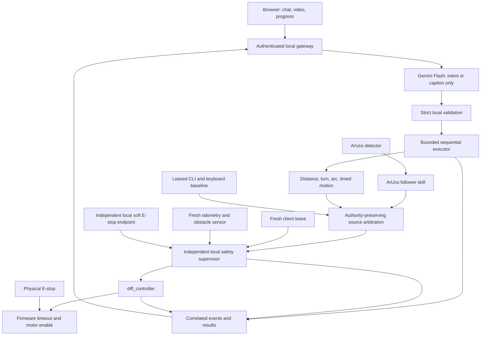
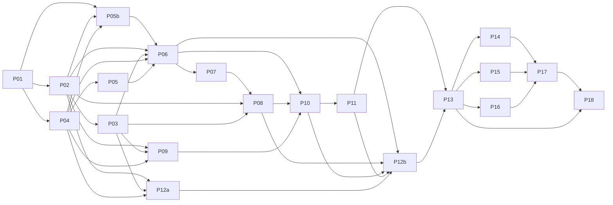

# Thesis robot consolidation blueprint

Version 1.0, 2026-09-26. Status: **final construction blueprint, with explicit execution gates**. Incorporates Antor's 2026-09-25 inventory. Finalization approves the plan's scope and order; it does not certify the robot or complete any implementation or experiment. No migration, firmware flashing, repository deletion, or publication approval is authorized by this document's creation.

## Objective and reading order

Make `aruco_marker_tracking_and_following_ros2` the sole deployable source for the existing robot, retaining its ArUco pipeline and adding bounded language control, deterministic execution, observable safety, web interaction, and reproducible research. Finish and accurately report Tests 1–8 before the final retirement gate. An unsuccessful experimental result can be complete evidence; unsafe operation is a reason to stop testing, not to keep collecting trials.

Read this file, [source audit](consolidation-source-audit.md), [execution contracts](consolidation-contracts.md), [PR work packages](consolidation-steps.md), [deployment runbook specification](consolidation-deployment.md), and [research protocols](consolidation-research.md). All are one blueprint package. Paths in those files are relative to the target repository unless prefixed `sia-bot/` or `required-tests/`, which refer to sibling input directories. Newly proposed files, scripts, packages, services, and commands **do not exist yet**. Their owning PR must implement and validate them before subsequent steps may use them.

Start with the [reconciled robot inventory and execution gates](robot-inventory-reconciled.md), which supersedes earlier unknown-platform assumptions. Deployment target: **Raspberry Pi 5 / 8 GB, Ubuntu 24.04.4 ARM64, ROS 2 Jazzy, Python 3.12, domain 42, reported Fast DDS, Camera Module 3 CSI via camera_ros/libcamera, Nano + L298N + encoder motors**. Snapshot confirms stamped controller input and odometry, with no active `/scan` evidenced. It does not demonstrate obstacle protection, independent E-stop, firmware timeout or disconnect stopping.

## Decisions and interview ledger

| ID | Decision / evidence needed | Current state | Recommended branch and consequence | Alternative and consequence |
|---|---|---|---|---|
| D1 | Actual platform and topics | Inventory received; platform selected as above; source/firmware provenance and calibration still incomplete | Keep native Jazzy on Pi 5; G1/G2 close remaining configuration/provenance gaps in P01. Use camera_ros, verified topic names and types. | No OS migration. A Git error at `~/amr_robot` does not establish Git state inside package directories. |
| D2 | Physical E-stop, watchdog, obstacles, test area, disconnect behavior | Report explicitly unknown; `/scan` absent in observed graph | G3–G5 require physical disable/watchdog, sensing integration and measured stop qualification. Add P05b to restore or introduce real obstacle sensing. | Unknown sensing blocks floor research; no LLM-caption or always-clear substitute. Powered bench checks require independent disable first. |
| D3 | Preserve every thesis claim? | **User confirmed: preserve goals; correct or narrow claims** | Retain web-first bounded control and Tests 1–8; replace unsupported numbers and document architecture changes. | Preserving every feature would need extra implementation and studies; not selected. |
| D4 | Gemini provider/model, API access, budget, vision, offline behavior | Planning default selected from requested recommendation; no account access or spending authorization inferred | Plan direct Google `gemini-3.8-flash`, low thinking, scene descriptions, and local stop/status without API. G6 requires current model/access/budget validation before live calls; mocked development may proceed. | Lite is optional separately evaluated cost comparator. No automatic provider/model fallback. Omitting description would amend required study task. |
| D5 | Study operator/recruiter, safety observer, institutional requirements, consent/data retention | **User confirmed: undecided** | Assign owner to obtain supervisor/institution determination, recruit operator/observer and plan participants in P12a; do not assume approval or participants exist. | Unavailable recruitment/approval leaves Tests 2–3 pending; software or synthetic participants cannot complete them. |
| D6 | Comparison condition | **User confirmed: web versus CLI-plus-teleop toolchain** | Two-condition counterbalanced within-participant study, equal safety gates and task capabilities. Report a toolchain comparison, not separate causal effects of CLI and teleop. | Three separate conditions increases burden; not selected. |
| D7 | Retire sia-bot | **User confirmed: cease deployment; retain read-only archive** | P18 removes deployment dependency after all gates; preserve provenance and restore instructions. | No local deletion or hosted-repository archival selected. |
| D8 | Exact task grounding and acceptance tolerances | Proposed; resolve in P01/P12 | Document a surveyed window bearing for the study, explicit circle radius/direction, and clarification policy. Pilot and freeze tolerances before research data. | Semantic recognition of arbitrary windows requires a new perception/localization capability and validation. Never pretend the current marker follower provides it. |

The user requested finalization with this report. Remaining unknowns now have owners, closure evidence and blocked actions in G1–G7; they are not grounds to invent answers or certify readiness. D5 remains an execution gate for study collection. D8 is frozen with the study protocol before collection. See [researched Gemini recommendation](consolidation-model-choice.md); recheck availability at P09 rather than silently changing models.

## Architecture decision

The user-supplied summary of the previous council recommendation is the starting hypothesis; the original council transcript was not supplied. Static inspection supports retaining the ArUco detector, visual controller, serial hardware interface, robot description, and simulation as the hardware-specific foundation. It does **not** establish that this snapshot equals the running robot, or that the commander supports thesis-wide behavior.

Adopt Gemini only as an untrusted text-to-intent translator, with a separate read-only image-caption operation. No LLM tool may publish velocities, change policy, invoke a shell, call arbitrary ROS services, or reset a safety latch. Deterministic local software owns execution and all stops. Port useful contracts and UI behaviors from sia-bot only after adapting and testing them; do not carry over ROSA/LangChain as an actuator or copy its environment lockfile.

One final velocity publisher is permitted: the supervisor. All existing follower, joystick, CLI, and simulator paths must route through it with authority-bearing candidates. The arbitration box is the supervisor's deterministic selector; existing twist_mux is not assumed to preserve custom goal/lease identity and loses its direct actuator route. E-stop affects every source. An ordinary ROS topic name is not an access-control boundary: protect controller topics from untrusted DDS/rosbridge clients, restrict network exposure, and test publisher ownership. Physical E-stop and controller firmware timeout remain necessary if Linux, DDS, or the supervisor fails.

## Dependency graph and effort

Effort estimates are engineering person-days, including focused review/verification, excluding hardware procurement, institutional waiting, recruitment lead time, and corrective iterations after failed physical gates. Research collection needs an operator and observer; person-days are not elapsed days. Strongest reasoning/review is appropriate for contracts, safety, study design, and claims; default implementation support is sufficient for constrained UI/package work.

| PR | Deliverable | Depends on | Estimate |
|---|---|---|---|
| P01 | Complete baseline source/firmware/configuration provenance | Received inventory; G1/G2 follow-up | 1–2 |
| P02 | Intent, skill, event, safety and topic contracts | P01 | 2–3 |
| P03 | Correlated event recorder and data schemas | P02 | 2–3 |
| P04 | Reproducible environment, clean build, no-motion launch | P01 | 2–4 |
| P05 | Motor disable, firmware watchdog, serial fault handling | P01, P04 | 3–6 plus hardware lead time |
| P05b | Restore or integrate obstacle sensing and freshness evidence | P01, P02, P04; G4 hardware choice | 2–4 plus hardware lead time |
| P06 | Final safety supervisor and arbitration | P02, P03, P04, P05, P05b | 3–5 |
| P07 | Feedback-based bounded motion skills | P06 | 3–5 |
| P08 | Sequential executor, cancellation and idempotency | P02, P03, P07 | 2–4 |
| P09 | Gemini adapter and strict intent validation | P02, P03, P04, D4 | 2–3 |
| P10 | Web gateway, chat, leases, stop, status/health | P06, P08, P09 | 3–5 |
| P11 | Video and snapshot/description pipeline | P10, D4 | 2–4 |
| P12a | Experiment harness, frozen datasets, analysis, study protocol | P02, P03, P04, D5/D6/D8 | 2–3 |
| P12b | Executable safe CLI/teleop comparison | P06, P08, P10, P11, P12a | 1–2 |
| P13 | Integrated qualification and junior clean-checkout rehearsal | P05–P12 | 2–4 |
| P14 | Tests 1/4/5/6 collection and audited results | P12, P13 | 3–5 |
| P15 | Tests 7/8 network and endurance evidence | P12, P13 | 2–3 plus six-hour run |
| P16 | Tests 2/3 human study and paired results | P12, P13, D5 cleared | 3–5 plus recruitment |
| P17 | Publication evidence and claim audit | P14, P15, P16 | 2–4 |
| P18 | Retire sia-bot deployment and preserve archive | P13, P17 | 1–2 |

Total work-package estimate: **43–76 person-days**; allow roughly **48–84 person-days including integration contingency**, plus external waiting. A single developer should budget roughly 10–17 working weeks before external delays. The extra 2–4 days covers the now-explicit obstacle-sensing gap; sensor procurement and electrical work can extend elapsed time. These are estimates, not a delivery promise.

There are **20 PR-sized packages**, including P05b for obstacle sensing and P12a/P12b for protocol preparation/baseline implementation. References to P12 denote that pair. Likely critical path: P01 → P04 → slower of P05/P05b → P06 → P07 → P08 → P10 → P11 → P12b → P13 → collection of P14/P15/P16 → P17 → P18. P02/P03 also precede P06; late API access makes P09 critical; recruitment/hardware lead time can dominate. P05 and P05b can progress independently after P04 with shared launch changes coordinated. P12a preparation and P09 can overlap skill development. P14/P15/P16 share one robot: schedule their physical collection serially, not at the maximum of their individual durations; analyze completed datasets in parallel with unrelated collection. No concurrent PRs edit shared contracts/configuration without an integration owner.

## First executable step

Continue **P01 baseline provenance**, using only the [targeted follow-up](robot-inventory-reconciled.md#targeted-follow-up-for-the-junior). Platform discovery is done; do not repeat it wholesale. Locate package repositories under `~/amr_robot/src`, resolve installed prefixes and actual launch commands, preserve firmware/configuration/calibration, inspect the unidentified `/diffbot` and `/cmd_vel_emergency` paths, and record physical stop/sensor hardware with the maintainer. Keep the robot stationary. No movement, disconnect or stop-effectiveness test is part of this first step.

Repository history is established in `D:\dev\thesis\aruco-pr-worktree`: upstream `antorrrr/aruco_marker_tracking_and_following_ros2`, base `main` at `05acc03f0d00a3afdb04ce254115cccebd1e22bd`, fork `omorShahriar/aruco_marker_tracking_and_following_ros2`, blueprint branch `docs/thesis-robot-consolidation-blueprint`, [PR #1](https://github.com/antorrrr/aruco_marker_tracking_and_following_ros2/pull/1). Initial blueprint commit is `d9a7bf75a257791f3889e0d1f820e900baebdb01`. The original unpacked Windows folder remains a separate copy; neither it nor Git failure at the robot workspace root proves the running package revision. P01 must reconcile that deployment with versioned source before hardware changes.

## Global completion and mutation rules

Every PR has one owner, a bounded diff, evidence manifest, review of safety implications, and a rollback rehearsal where relevant. See work packages for exact components, commands, evidence and exit criteria. Freeze interfaces in P02; if they change, version them, migrate consumers, update the graph, and invalidate affected tests. Never retroactively re-label pilot output as confirmatory research.

Track states `not_started`, `in_progress`, `blocked(reason/owner)`, `verified`, and `superseded`; never mark a physical gate verified from static analysis. Splitting a PR preserves its ID with suffixes and inherits dependencies; inserting/reordering work requires a cycle check and assessment of affected evidence. Scope reductions require a claim-map/protocol amendment, never silent omission of a required test. Record deviations and failures append-only. Do not overwrite raw results or tune thresholds after viewing confirmatory outcomes.

Publication evidence completion requires all eight test dossiers with counts, denominators, failures, protocol deviations, scripts, tables/figures, and claim dispositions. It does not establish novelty, statistical power for all comparisons, regulatory safety, or paper acceptance. No research outcomes were produced during blueprint preparation.

Version 1.0 finalization: incorporate supplied inventory, reconcile contradictions, select the native deployment branch, assign unresolved items to execution gates, review dependencies and physical prerequisites, and preserve all eight test requirements. Blueprint completion is separate from P01–P18 implementation completion. Personal memory is not updated.

## Blueprint verification record

Two independent-review passes were performed under the blueprint skill (second pass after resuming). Findings led to atomic authority-bearing velocity candidates, explicit stop/status admission exemptions, separate admission/execution deadlines, limited commissioning before measured braking qualification, P02 ownership of surveyed-landmark schema, bounded Test 8 endpoint claims, complete test dependency setup, and splitting P12a/P12b. The second review confirmed the major corrections and found two residual cross-document inconsistencies; those were corrected in the contract, work-package and deployment documents. Review establishes document coherence, not hardware safety or successful execution.

The earlier draft passed structural checks for 19 packages. Version 1.0 adds P05b and passes graph/step parity (20 packages, 41 edges), acyclicity, all required per-step fields and local-link/code-fence checks. An additional independent adversarial review against the submitted inventory found no remaining critical or important issues in the finalized plan. Input PDF/test-file fingerprints remain in the source audit; raw inventory is retained unchanged and hashed, with a file-specific Git attribute preserving its bytes. Model research is dated 2026-09-25 and is revalidated before implementation. No ROS build, physical gate, participant experiment, API capability probe or migration was executed here.

Immediate handoff: junior completes G1/G2 provenance and maintainer inspection, while owner assigns G6 provider access/budget and G7 study arrangements. P05/P05b/P06/P13 own closure of physical safety/sensing/qualification gates. Work can be prepared using mocks/simulation within those limits; a disabled sensor is never replaced by an assumed-clear value to complete a test.
